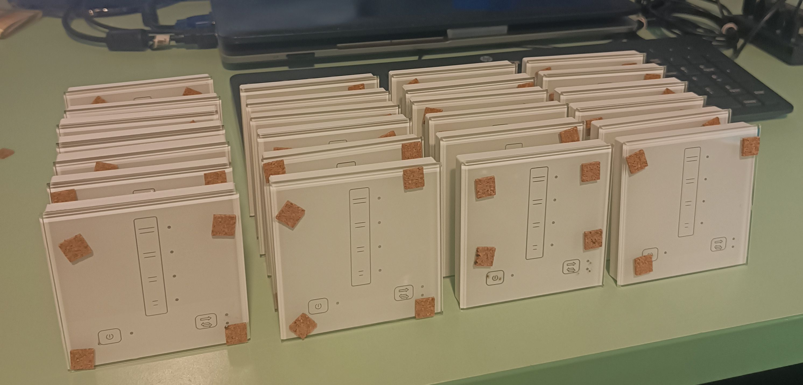
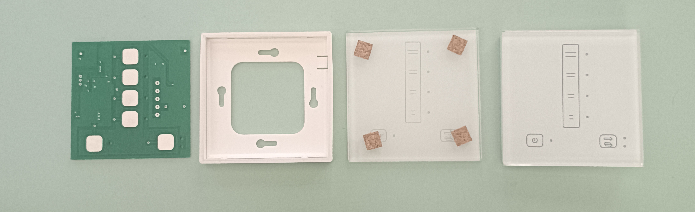
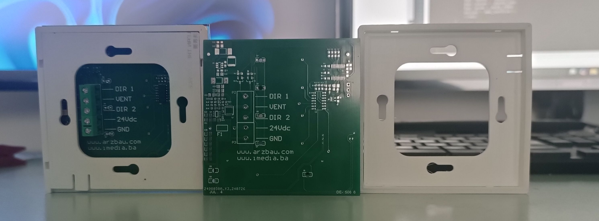

# FreshAir


Energy-efficient indoor air quality controller for decentralized ventilation systems with heat recovery, balanced airflow management, capacitive touch control, and production-ready embedded hardware.

FreshAir is a complete embedded control platform designed for residential and light commercial ventilation applications where indoor air quality, energy efficiency, and pressure balance are critical. The system is intended for use with decentralized ventilation units and heat-exchanger-based airflow systems that alternate between air extraction and fresh air supply while recovering part of the thermal energy back into the room.

This repository contains the full engineering package of the product, including embedded firmware, custom hardware design, manufacturing outputs, technical references, and real device photography.

## Device Gallery

### Assembled Device



### Front View


### Rear View


### Internal Parts



### Enclosure and Mechanical Parts



## System Purpose

FreshAir is a dedicated ventilation and indoor air quality controller built for decentralized heat-recovery applications. It is designed to manage controlled air exchange in enclosed spaces while minimizing unnecessary thermal losses and maintaining more stable room conditions.

The device is intended for systems where stale indoor air is periodically extracted and fresh outdoor air is introduced through a thermal exchange element. During alternating airflow cycles, the heat exchanger stores and returns part of the thermal energy, improving efficiency in both heating and cooling seasons.

This makes the platform suitable for applications where the goals are:

- improved indoor air quality
- continuous or scheduled fresh-air renewal
- reduced heating and cooling losses
- support for energy-efficient and green-building ventilation concepts
- balanced airflow operation in occupied spaces

## Energy Efficiency and Heat Recovery

FreshAir is built for ventilation systems that do more than just move air. Its operating concept supports decentralized heat recovery, where extraction and supply airflow are alternated through a heat-exchange element.

A typical cycle works as follows:

- indoor air is extracted first
- thermal energy is transferred into the exchanger
- airflow direction is then changed
- fresh outdoor air is supplied back through the same path
- part of the stored energy is returned into the room

This process helps:

- reduce heating losses in winter
- reduce cooling losses in summer
- improve comfort without wasting as much conditioned air
- position the product as a practical green-energy ventilation solution

## Multi-Fan Operation and Pressure Balance

FreshAir is designed as a controller for analog DC ventilation systems and can be used in multi-fan arrangements from a single control unit.

In practical installations, one controller can be used to drive multiple DC ventilation motors so that intake and exhaust airflow remain balanced. A typical example is:

- two ventilators supplying fresh air
- two ventilators extracting stale indoor air

This balanced arrangement helps avoid unwanted underpressure inside the room. That is especially important in spaces with fireplaces, stoves, or other combustion-based appliances, where negative pressure can disturb combustion conditions or pull smoke back into the living area.

This is not a trivial feature. It is a functional safety and comfort advantage of the system architecture.

## Control Method

FreshAir uses PWM as a control mechanism for analog DC motor regulation.

The controller is not presented as a complex digital motor-drive platform; instead, PWM is used as a stable and practical method for controlling an analog DC drive stage for ventilation motors. This allows smooth airflow control while remaining appropriate for compact embedded ventilation electronics.

According to the intended product use, the controller is designed to support multi-motor DC ventilation loads up to approximately **2 A DC**, depending on the connected fan configuration and output-stage implementation.

## Product Features

### Ventilation Operation
- support for decentralized ventilation workflows
- alternating airflow operation for heat-recovery applications
- fixed-direction ventilation mode
- multi-speed airflow control
- smooth speed transitions
- temporary boost mode
- scheduled pause mode

### Energy and Comfort
- designed for systems using thermal recovery elements
- reduces avoidable heating losses in winter
- reduces avoidable cooling losses in summer
- improves fresh-air renewal without the same penalty as uncontrolled ventilation
- suitable for green-energy and energy-conscious building concepts

### Pressure and Airflow Management
- supports balanced intake/exhaust configurations
- suitable for multi-fan arrangements
- helps reduce unwanted room underpressure
- useful for installations where combustion appliances are present

### User Interface
- capacitive touch control surface
- LED-based status and mode indication
- no-display interaction model with structured command logic
- short-touch and long-touch behaviours for expanded functionality

### Embedded Reliability
- persistent state restore after restart
- filter service timer and reminder logic
- touch recalibration logic
- optional watchdog support
- production-oriented firmware and hardware source package

## User Interface Model

FreshAir uses a minimalist touch interface, but the firmware implements significantly more than a basic button panel.

Although the front panel has only a small number of capacitive inputs, the firmware provides a menu-like interaction model built from:

- multiple capacitive touch inputs
- contextual LED signalling
- short-touch and long-touch actions
- state-dependent behaviour

In practice, this gives access to:

- speed selection
- mode switching
- timed pause selection
- boost activation
- filter service acknowledgement/reset
- retained operating state after restart

It behaves like a compact embedded menu system without requiring a display.

## Operating Modes

The firmware implements explicit operating states for real device behaviour rather than a simple on/off output model.

### Main States
- **Off**
- **On**
- **Pause**
- **Boost**

### Operating Modes
- **HR mode**  
  Alternating airflow operation used for heat-recovery applications.

- **Vent mode**  
  Fixed-direction ventilation mode for standard airflow operation.

### Pause Options
- 1 hour
- 2 hours
- 4 hours
- 8 hours

### Boost Behaviour
- long-touch activation
- maximum airflow mode
- automatic timeout
- return to previous operating context

## Embedded Control Logic

The firmware is built around a proper state machine and handles significantly more than basic fan switching.

Implemented behaviours include:

- touch input acquisition
- operating-state management
- speed and mode transitions
- timed pause handling
- boost mode timeout
- LED indication logic
- runtime timer processing
- filter maintenance tracking
- EEPROM-backed persistence
- alternating direction sequence for heat-recovery operation

One of the key implementation details is that direction switching in heat-recovery mode is not abrupt. The controller introduces controlled stop-and-switch timing before changing airflow direction, which supports stable operation and aligns with the practical requirements of alternating ventilation systems.

## Firmware Platform

Firmware sources are located in:

- `fw/DE-260624`

The project is based on an STM32 embedded platform and uses STM32Cube/HAL project structure.

### MCU Platform
- **STM32F030F4P6**
- STM32F0 family
- TSSOP20 package

### Firmware Interfaces
- **I2C1**
  - capacitive touch controller communication
  - external EEPROM communication

- **TIM3 PWM**
  - analog DC motor control reference generation

- **GPIO**
  - airflow direction control
  - LED outputs
  - touch interrupt/alert input

- **IWDG**
  - optional watchdog support

### Persistent Storage
The firmware stores operating state in external I2C EEPROM so that the device can recover its previous configuration after power loss or restart.

## Capacitive Touch Control

FreshAir uses the CAP129x capacitive touch family, with the firmware configured for a CAP1298-class device.

This provides:

- multiple touch channels
- interrupt-assisted event detection
- configurable sensitivity
- recalibration support
- stable front-panel interaction without mechanical buttons

This is a strong fit for a sealed or design-oriented wall controller product.

## Hardware Design

Hardware design files are located in:

- `hw/DE-250624`

The hardware repository contents indicate a complete PCB design workflow, including:

- schematic source files
- PCB layout source files
- component libraries
- project configuration
- generated outputs
- fabrication deliverables
- pick-and-place data
- Gerber and production files

This is a production-oriented hardware package rather than a partial prototype archive.

## Manufacturing Readiness

The repository includes fabrication outputs and assembly-related export files, such as:

- Gerber-style layer outputs
- drill/report files
- pick-and-place files
- fabrication ZIP archives
- PCB production outputs

That makes the repository suitable for:

- hardware review
- manufacturing handoff
- assembly preparation
- future hardware revision control

## Visual Documentation

The repository includes real product photography in:

- `assets/images/device-assembled-front.jpg`
- `assets/images/device-assembled-back.jpg`
- `assets/images/device-assembled.jpg`
- `assets/images/device-parts.jpg`
- `assets/images/device-parts-casing.jpg`

These assets support technical presentation, product documentation, and professional portfolio use.

## Repository Structure

```text
FreshAir/
├── assets/
│   └── images/
│       ├── device-assembled.jpg
│       ├── device-assembled-front.jpg
│       ├── device-assembled-back.jpg
│       ├── device-parts.jpg
│       └── device-parts-casing.jpg
├── doc/
│   ├── component datasheets
│   ├── application notes
│   ├── ventilation reference material
│   └── prototype and dimensional assets
├── fw/
│   └── DE-260624/
│       ├── Core/
│       ├── Drivers/
│       ├── MDK-ARM/
│       └── DE-260624.ioc
├── hw/
│   ├── DE-250624/
│   │   ├── schematic and PCB design files
│   │   ├── project outputs
│   │   ├── fabrication files
│   │   └── production assets
│   ├── DE-250624_FabricationOutput.zip
│   └── DE-250624_FabricationOutputTest.zip
└── README.md
```

## Engineering Positioning

FreshAir should be understood as a compact embedded controller for efficient decentralized ventilation, not as a generic electronics exercise.

The project combines:

- indoor air quality management
- heat-recovery-oriented airflow control
- analog DC multi-fan regulation
- pressure-aware installation strategy
- capacitive touch interaction
- persistent embedded control logic
- custom hardware design
- production-ready outputs

This makes it well suited for professional presentation as a real green-energy and air-quality product platform.

## Summary

FreshAir is a dedicated indoor air quality and energy-saving ventilation controller for decentralized heat-recovery systems. It is designed to coordinate alternating airflow, balanced multi-fan DC operation, touch-based user interaction, persistent state handling, and production-ready embedded electronics in one integrated platform.

The repository documents the full product stack: firmware, hardware, manufacturing data, technical references, and assembled device implementation.
